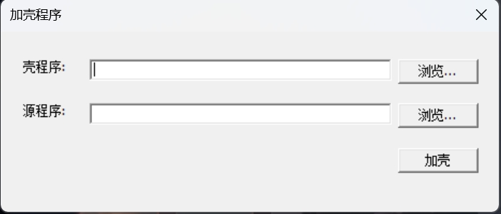

# EncryptDecryptShell
滴水三期项目-加密解密壳

### 由于在壳子项目中引用了加壳项目的头文件
需要右键壳子项目-》属性 -》C/C++ -》常规 -》附加包含目录 -》添加 $(SolutionDir)\\加壳项目;

需要右键壳子项目-》属性 -》链接器 -》常规 -》附加库目录 -》添加 $(SolutionDir)\\加壳项目;

### 开发环境

vs2022 + win11

### 图片如下

### 程序中可能出现的问题

1、权限问题

你在一个进程中申请空间，写数据，都需要权限，所以程序开头，调用了AdjustPrivileges()来提权，如果直接双击运行，会报提权失败，错误码 1300，请右键以管理员身份运行

2、基址问题

权限过了，你运行程序时，会卡一下，然后报 0xc0000005，因为新的VS版本，默认开启了随机基址ASLR，通过卸载外部shell，加载src，修改imagebase，这会被ASLR检测，导致程序无法执行。

ASLR只会检测原始baseAddress存在与否, 并不对里面的数据加以验证.

3、如果源程序是Release版本，右键管理员运行，没反应，也没错误弹窗

这个问题暂时没解决